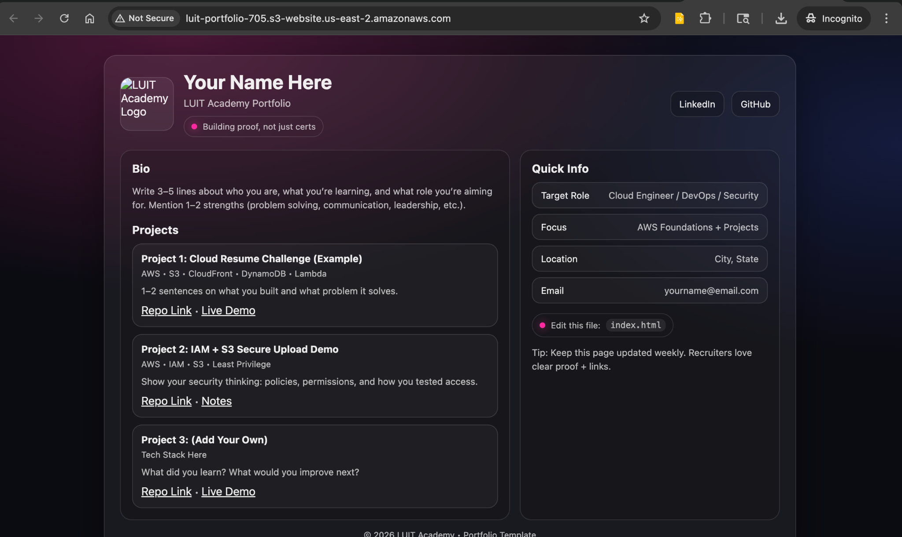
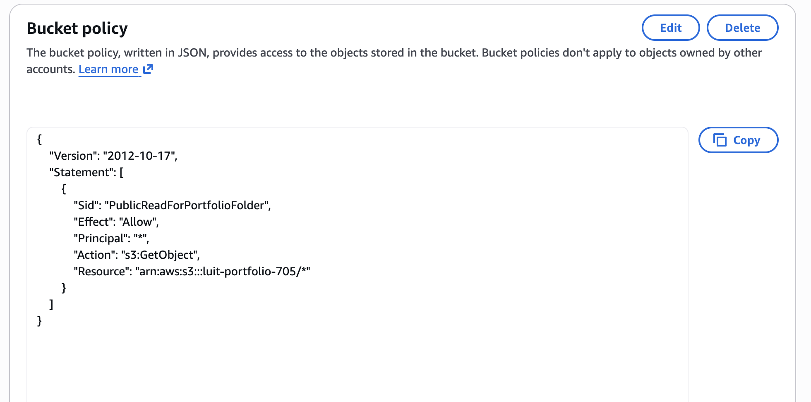

# aws-s3-static-website
Deployed a static portfolio website using Amazon S3, resolving public access, bucket policy, and static website hosting configurations.
## 🌐 S3 Static Website Portfolio Deployment

This update documents the successful deployment of a static portfolio website using Amazon S3.

### What Was Completed
- Enabled **S3 Static Website Hosting**
- Uploaded and configured `index.html` as the entry point
- Resolved **403 AccessDenied** errors by aligning:
  - Bucket policy scope
  - Object paths
  - Static website index configuration
- Disabled Block Public Access at the bucket level (intentionally)
- Applied a scoped **public-read bucket policy** for website content
- Verified the site using the **S3 website endpoint**

### Key Learnings
- S3 is private by default and requires explicit permission for public access
- Static website endpoints differ from standard S3 object URLs
- Bucket policies must match object paths exactly
- Secure-by-default AWS behavior prevents accidental exposure

  ### Screenshots
  
### Live S3 Static Website

### Static Website Hosting Configuration

### Bucket Policy Configuration

### Website Files in S3

### Result
A live, publicly accessible static portfolio hosted on Amazon S3, serving as a foundation for documenting cloud projects and professional growth.

🔗 **Live Site:**  
http://luit-portfolio-705.s3-website-us-east-2.amazonaws.com
